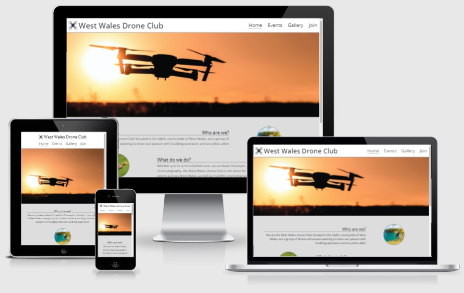

<h1 align="center"> User Centric Frontend Development Milestone Project </h1>

[Access the final submitted version of the project hosted on GitHub Pages here.](https://j-white94.github.io/User-Centric-Frontend-Development-Milestone-Project/index.html)

This website has been designed for a fictional drone flying club in West Wales. Care has been taken to ensure the website is well structured and responsive with respect to device screen sizes, enabling users of all device sizes to easily navigate the pages.

<h2 align="center"></h2>

## User Experince (UX)

- ### User Stories
    - #### New User Goals
        1. As a New User, I want to be able to easily navigate the website
        2. As a New User, I want to be excited by drones
        3. As a New User, I want to sign up to the drone club

    - #### Existing User Goals
        1. As an Existing User, I want to find information on upcoming events
        2. As an Existing User, I want to be excited by drones
        3. As an Existing User, I want to see engagement from other users on the site

- ### Planes of UXD

    1. Strategy:
        - What am I making?
            - a website for a local drone flying club
        - Why am I making it?
            - to provide resources and community for local drone flying enthusiasts
        - What makes it special?
            - the first drone club in the area
        - What does the site operator want?
            - to create a network of drone flying enthusiasts by
        - What does the site visitor want?
            - to become part of a community of drone flying enthusiasts and informational resources

    2. Scope:
        - Drone flying informational resources, event days, images
        - links to information on drone legality in UK, form to sign up to join club, list of current events, images of drones throughout

    3. Structure:
        - Index (home) page with nav bar leading to 4 pages: Home, Events, Gallery, Join
        - Events page listing local drone flying events in the community
        - Gallery page showcasing user-submitted images of drones in the community
        - Join page featuring webform to sign up to local drone club

    4. Skeleton:
        - Site header: logo image on left with club name, nav bar
        - Home page: hero image below header, information section split into 3 parts: about; events; why join; each with relevant accompanying image to enhance message.
        - Events page: vertical centered list of weekly drone flying events taking place in the area, details of cinematography competition at the bottom of page, above footer.
        - Gallery: page of user-submitted images of drones or from drones
        - Sign-Up: page with web form to sign up to join club
        - Site footer:	links to Civil Aviation Authority page on drone flying in UK, links to social media pages of club

    5. Surface:
        - #### [index.html wireframe](https://j-white94.github.io/User-Centric-Frontend-Development-Milestone-Project/assets/images/readme-index-wireframe.png)

        - #### [index.html mobile wireframe](https://j-white94.github.io/User-Centric-Frontend-Development-Milestone-Project/assets/images/readme-index-mobile-wireframe.png)

        - #### [events.html wireframe](https://j-white94.github.io/User-Centric-Frontend-Development-Milestone-Project/assets/images/readme-events-wireframe.png)

        - #### [gallery.html wireframe](https://j-white94.github.io/User-Centric-Frontend-Development-Milestone-Project/assets/images/readme-gallery-wireframe.png)

        - #### [join.html wireframe](https://j-white94.github.io/User-Centric-Frontend-Development-Milestone-Project/assets/images/readme-join-wireframe.png)

- ### Design
    - #### Site colours
        - the site primarily features muted greyscale colours, with #dddddd being used for background elements and #333333 for content, to provide a sophisticated and well-contrasted design. Other colours feature where appropriate, with images providing the bulk of colour to enhance the user experience.

    - #### Site font
        - the site font is set to Open Sans throughout, with Sans Serif chosen in the event that Open Sans fails. Open Sans is clearly legible, having been:
            > optimized for print, web, and mobile interfaces
            - [Open Sans](https://fonts.google.com/specimen/Open+Sans#about)

    - #### Site images
        - the images throughout the site provide the bulk of colour to the pages, and have been chosen to reflect the quality of the content. The hero image on the home page inspires with a will to fly. The images from the who, what, why section compel thoughts on the beauty of the Welsh countryside, the excitement of drone flying, and the sense of community to be gained from the club, respectively. The background image of the events page relates to the inherent outdoorsness of drone flying, while the background image of the join page features a drone pilot -- a representation of the user.

## Features
 - Fully responsive design allows website to work on all screen sizes.

## Technologies Used

- ### Languages Used
    - [HTML5](https://en.wikipedia.org/wiki/HTML5)
    - [CSS3](https://en.wikipedia.org/wiki/CSS)

- ### Frameworks, Libraries, and Programs Used
    - [Bootstrap 5.1](https://getbootstrap.com/docs/5.1/getting-started/introduction/)
        - the Bootstrap 5.1 library was used to assist in formatting the layout of the pages
    - [Google Fonts](https://fonts.google.com/)
        - the Open Sans font was imported from Google Fonts and is the sole font used on the website
    - [Font Awesome](https://fontawesome.com/)
        - Font Awesome icons were used in the footer to enhance external links and therefore feature on every page
    - [Git](https://git-scm.com/)
        - Git was used for version control
    - [GitPod](https://gitpod.io/)
        - GitPod was used as the cloud-based coding environment
    - [GitHub](https://github.com/)
        GitHub stores the code and hosts the website through GitHub Pages
    - [Balsamiq](https://balsamiq.com/)
        Balsamiq was used to create the wireframes when designing the website
    - [Paint](https://en.wikipedia.org/wiki/Microsoft_Paint) and [Paint 3D](https://www.microsoft.com/en-gb/p/paint-3d/9nblggh5fv99)
        - Paint and Paint 3D were used to crop and modify images to better suit the website

## Testing
The official [W3C Markup Validator](https://validator.w3.org/) and [W3C CSS Validator](https://jigsaw.w3.org/css-validator/) were used to validate the integrity of the HTML and CSS used in the project, respectively, and as a result there are now no HTML or CSS errors in the project.

- ### Bugs
    1. W3C Markup Validator found 3 instances of id "wales-img" in index.html, caused by copying and pasting sections during development
        - Solution: amend the id of "wales-img" in the 2 instances it was erroneous, replace with "racing-drone-img" and "handshake-img", respectively
    2. Nav menu crept too low and pushed hero image of index.html to the left, shrinking it
        - Solution: poured through code until missing "div" closing tag was noticed. After adding missing "div" closing tag, header worked as intended
    3. Gallery columns left gap above when situated below another column as a result of using Bootstrap columns to responsively change from 4 columns to 2 columns on smaller screen sizes
        - Solution: abandon Bootstrap columns for gallery.html image layout, borrow masonry layout used in Love Running HTML and CSS Code Institute project

- ### Testing User Stories from User Experience (UX) Section
    - #### New User Goals
        1. As a New User, I want to be able to easily navigate the website
            - The navigation menu is clearly visible at the top of the page on all screen widths.
        2. As a New User, I want to be excited by drones
            - The hero image on the home page conjures thoughts of flight in the new user 
        3. As a New User, I want to sign up to the drone club
            - The Join page link is clearly visible in the navigation menu at the top of the page and is also present in a call to action button at the bottom of the page, where the user is drawn to it after having read the content of the page

    - #### Existing User Goals
        1. As an Existing User, I want to find information on upcoming events
            - The Events page link is clearly visible in the navigation menu at the top of the page, and the Events page itself details the events due to take place.
        2. As an Existing User, I want to be excited by drones
            - The hero image on the home page conjures thoughts of flight in the existing user 
        3. As an Existing User, I want to see engagement from other users on the site
            - The Gallery page link is clearly visible in the navigation menu at the top of the page, and the Gallery page itself features user-submitted images relating to drones, further enhancing the sense of community

- ### Testing Website Functionality
    - Internal and external links were tested to ensure that no links were broken, allowing the user to navigate freely
    - Website was tested on multiple devices (Desktop, Android phone, iPad, iPhone) and browsers (Chrome, Edge, Firefox, Safari) to ensure compatibiltiy

## Deployment
- The website was designed in the GitPod coding environment and was deployed on GitHub Pages.

- ### GitHub Pages
- The website deployment was as follows:
    1. Navigate to [GitHub](https://github.com) and log in
    2. Find the relevant [GitHub Repository](https://github.com/j-white94/User-Centric-Frontend-Development-Milestone-Project)
    3. Click on the "Settings" button
    4. Select "Pages" from the menu that opens on the left
    5. Click the dropdown menu labelled "None" in the "Source", and then click the "main" option within the dropdown
    6. Click the "Save" button
    7. Click the [link](https://j-white94.github.io/User-Centric-Frontend-Development-Milestone-Project/) that appears in the green section near the top to navigate to the published website

## Credits

- ### Code
    - The masonry layout of the gallery.html page was taken from the Love Running HTML and CSS Code Institute project
    - Bootstrap 5.1 was used to assist in the structural layout of the pages and to help ease responsiveness

- ### Content
    - The page content was written by myself, the developer

- ### Media
    - The images used featured in the project were sourced from stock photo websites:
        1. [logo-img.jpg](https://j-white94.github.io/User-Centric-Frontend-Development-Milestone-Project/assets/images/logo-img.jpg) was sourced from https://www.freepik.com/free-vector/set-flat-design-drone-logo_12230241.htm, cropped and modified to provide simple vector logo for website
        2. [drone-silhouette-3-1.jpg](https://j-white94.github.io/User-Centric-Frontend-Development-Milestone-Project/assets/images/drone-silhouette-3-1.jpg) and [drone-silhouette-16-9.jpg](https://j-white94.github.io/User-Centric-Frontend-Development-Milestone-Project/assets/images/drone-silhouette-16-9.jpg) were sourced from
		https://pixabay.com/photos/camera-drone-photography-sunset-2558654/ and cropped to suit differe screen sizes
        3. [wales.jpg](https://j-white94.github.io/User-Centric-Frontend-Development-Milestone-Project/assets/images/wales.jpg) was sourced from https://pixabay.com/photos/coast-ocean-cliffs-beach-wales-4537432/
        4. [racing-drone.jpg](https://j-white94.github.io/User-Centric-Frontend-Development-Milestone-Project/assets/images/racing-drone.jpg) was sourced from https://pixabay.com/photos/drone-field-multicopter-905955/ and cropped
        5. [handshake.jpg](https://j-white94.github.io/User-Centric-Frontend-Development-Milestone-Project/assets/images/handshake.jpg) was sourced from https://pixabay.com/photos/handshake-hands-children-greeting-6557378/
        6. [events-background-img.jpg](https://j-white94.github.io/User-Centric-Frontend-Development-Milestone-Project/assets/images/events-background-img.jpg) was sourced from https://pixabay.com/photos/sea-beach-trees-coast-path-trail-5621150/
        7. [gallery-img-1.jpg](https://j-white94.github.io/User-Centric-Frontend-Development-Milestone-Project/assets/images/gallery-img-1.jpg) was sourced from https://pixabay.com/photos/flying-flying-drone-race-drone-3407010/
        8. [gallery-img-2.jpg](https://j-white94.github.io/User-Centric-Frontend-Development-Milestone-Project/assets/images/gallery-img-2.jpg) was sourced from https://pixabay.com/photos/drone-reverb-racing-quadcopter-3758182/
        9. [gallery-img-3.jpg](https://j-white94.github.io/User-Centric-Frontend-Development-Milestone-Project/assets/images/gallery-img-3.jpg) was sourced from https://pixabay.com/photos/flying-flying-drone-race-drone-3407013/
        10. [gallery-img-4.jpg](https://j-white94.github.io/User-Centric-Frontend-Development-Milestone-Project/assets/images/gallery-img-4.jpg) was sourced from https://pixabay.com/photos/flying-flying-drone-race-drone-3407009/
        11. [gallery-img-5.jpg](https://j-white94.github.io/User-Centric-Frontend-Development-Milestone-Project/assets/images/gallery-img-5.jpg) was sourced from https://pixabay.com/photos/drone-quadrocopter-hobby-camera-4165933/
        12. [gallery-img-6.jpg](https://j-white94.github.io/User-Centric-Frontend-Development-Milestone-Project/assets/images/gallery-img-6.jpg) was sourced from https://pixabay.com/photos/drone-quadcopter-aircraft-aerial-1153510/
        13. [gallery-img-7.jpg](https://j-white94.github.io/User-Centric-Frontend-Development-Milestone-Project/assets/images/gallery-img-7.jpg) was sourced from https://pixabay.com/photos/drone-flying-drone-quadrocopter-2724257/
        14. [gallery-img-8.jpg](https://j-white94.github.io/User-Centric-Frontend-Development-Milestone-Project/assets/images/gallery-img-8.jpg) was sourced from https://pixabay.com/photos/multicopter-drone-quadrocopter-1873532/
        15. [gallery-img-9.jpg](https://j-white94.github.io/User-Centric-Frontend-Development-Milestone-Project/assets/images/gallery-img-9.jpg) was sourced from https://pixabay.com/photos/drone-camera-drone-remote-controlled-6585450/
        16. [gallery-img-10.jpg](https://j-white94.github.io/User-Centric-Frontend-Development-Milestone-Project/assets/images/gallery-img-10.jpg) was sourced from https://pixabay.com/photos/ginkgo-fog-drone-landscape-3758236/
        17. [gallery-img-11.jpg](https://j-white94.github.io/User-Centric-Frontend-Development-Milestone-Project/assets/images/gallery-img-11.jpg) was sourced from https://pixabay.com/photos/drone-park-flying-camera-propeller-3181111/
        18. [gallery-img-12.jpg](https://j-white94.github.io/User-Centric-Frontend-Development-Milestone-Project/assets/images/gallery-img-12.jpg) was sourced from https://pixabay.com/photos/drone-camera-drone-aircraft-device-6586331/
        19. [join-img.jpg](https://j-white94.github.io/User-Centric-Frontend-Development-Milestone-Project/assets/images/join-img.jpg) was sourced from https://pixabay.com/photos/drone-man-drone-pilot-copter-3453361/

- ### Acknowledgements
    - The Code Institute Full Stack Web Development course for teaching me HTML and CSS